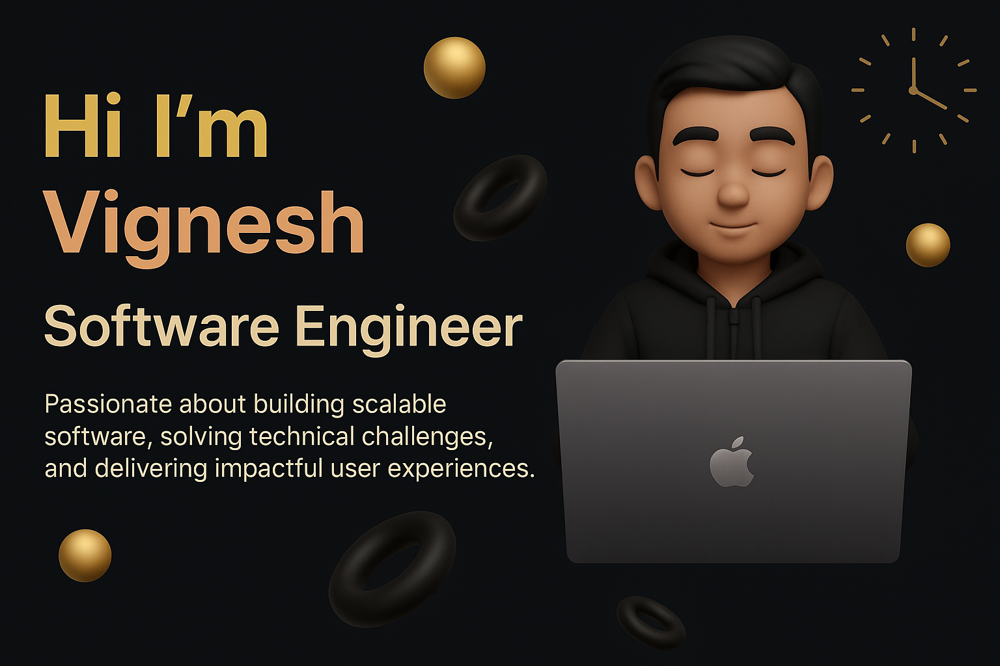

<h1 align="center">
  
</h1>

  

<h3 align="center">
  <strong>🚀 Hi, I'm Vignesh! A passionate Software Engineer | Focused on Dev, Cloud ⚙️</strong>
</h3>

## 🧠 About Me

<!-- - All about me is at **[Portfolio](https://tonmoysu.netlify.app/)** -->

- My name is `Vignesh`, a dedicated `Software Engineer` with **3+ years of industry experience`.
- Skilled in: `HTML`, `CSS`, `JavaScript`, `React`, `Bootstrap`, `Java`.
- Experienced with frameworks and libraries like `ReactJS`, `Tailwind CSS`.
- Ask me about: `React`, `Java`, `AWS`.
- I love exploring new technologies and building innovative web applications.
- Check out my portfolio here: **[Portfolio]()** <!-- Add your portfolio link -->
- All of my projects are available at 

---
## 🌐 Connect With Me

  
  &nbsp;
  

---
## 💡 Competitive Programming & Problem Solving

    
  &emsp;
    
  &emsp;
    

---
## 🧰 Tech Stack

### 🖥️ Frontend
  
 
     
  

### 🧠 Backend
  

     
  

### 🗄️ Database
  

     
  

### ☁️ Cloud & DevOps
  

    
  

### 🛠️ Tools I Use

  

---

  🔥 Let's build amazing things together!

